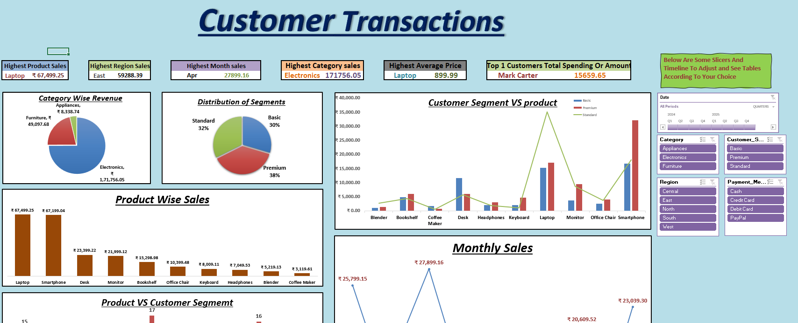

  
# 📊 Data Intelligence Dashboard

Welcome to the **Data Intelligence Dashboard** — a powerful tool built in Excel that transforms raw sales data into actionable insights! This dashboard gives you a high-level view of customer behavior, regional performance, and product trends, all in a visually intuitive format. 🚀

## 👤 Created By

**Your Name:** Namya Shah  
**GitHub:** [github.com/Namyashah](https://github.com/Namyashah)
**GitHub Repo:**[https://github.com/Namyashah/PR_Final_Project_Excel]
---

## ✨ Features

🔍 **Interactive Dashboard**  
Get quick insights from clean visual representations of sales, regions, and product categories.

📈 **Pivot Table Analysis**  
Drill down into the data with dynamic pivot tables for advanced filtering and segmentation.

🛒 **Customer & Product Segmentation**  
Understand who’s buying what, and when. Discover trends across various customer segments and product types.

💳 **Payment Method Insights**  
Analyze preferences in payment methods to optimize checkout strategies.

🌍 **Regional Breakdown**  
Identify high-performing regions and uncover hidden market opportunities.

📅 **Time-Based Trends**  
Track changes in purchasing behavior over time to support strategic decision-making.

🧪 **What-If Analysis**  
Test different business scenarios and their impact using Excel's built-in What-If tools.

📉 **Linear Regression**  
Perform trend analysis and forecasting using Excel's regression tools.

📘 **Function Library Showcase**  
A dedicated sheet explains all the functions used, including:
- `IF` statements for conditional logic
- `VLOOKUP` for dynamic data retrieval
- `INDEX` & `MATCH` for advanced lookups
- `SUMIFS`, `COUNTIFS` for segmented summaries
- Custom formatting for clear, color-coded data
- Dynamic charts for real-time visuals

---

## 📁 Dataset Overview

The dataset includes:
- **Transaction ID**
- **Date**
- **Customer & Product IDs**
- **Category, Quantity, Price**
- **Payment Method & Region**
- **Customer Segment & Lifetime Value**

---

## 🧠 Technologies Used

- Microsoft Excel
- Pivot Tables
- Conditional Formatting
- What-If Analysis Tools
- Regression Analysis
- Dashboard Charts

---

## ✅ How to Use

1. Open the Excel file.
2. Navigate to the `DashBoard` sheet to interact with the visual dashboard.
3. Explore `Pivot Tables` for custom insights.
4. Review `Function Reference` sheet for a list of Excel functions used.
5. View raw data in `Final Project Dataset`.
6. Read `Project Instructions` for more context.
